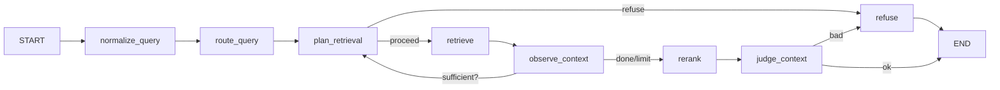

# RAG Knowledge Base

[English](README.en.md) | [简体中文](README.md)

A **production-grade RAG (Retrieval-Augmented Generation) knowledge base QA system** built for Chinese-language scenarios. The backend is powered by **FastAPI + LangGraph** to orchestrate a full Agentic RAG workflow; the frontend uses **React 19 + Antd 6** to provide day-to-day Q&A and operations UI; and core capabilities are also exposed as tools through **FastMCP**, so external agents (Claude, Cursor, in-house agents, …) can call them directly.

> The project covers a real, end-to-end RAG pipeline: multi-format document ingestion → Chinese-friendly hybrid retrieval → query routing & multi-turn rewriting → rerank → answer verification → refusal gate → citation-level observability — plus the engineering capabilities you'd expect: RBAC, rate limiting, semantic caching, incremental indexing, and automated evaluation.

---

## Core Features

- **Multi-format document parsing & ingestion**: PDF / DOCX / Markdown / HTML are converted to Markdown via **Docling**, then split with a custom Chinese-friendly chunker (default 600 chars / 60-char overlap).
- **Chinese hybrid retrieval**: `pgvector` HNSW vector search + a custom PostgreSQL image with the **zhparser** Chinese full-text engine, fused with **RRF** (Reciprocal Rank Fusion) to sidestep the score-scale mismatch between the two paths.
- **Agentic RAG workflow**: an 8-node state machine on **LangGraph** — `normalize_query → route_query → plan_retrieval → retrieve → observe_context → rerank → judge_context → generate/refuse` — supporting up to 3 rounds of "re-retrieve" so the agent can truly observe and replan.
- **Query routing & rewriting**: four strategies — `original / rewrite / hyde / multi_query` — selected automatically by question type; `multi_query` expands a single question into several sub-queries to improve recall.
- **Rerank + answer verification**: Qwen3-Rerank for second-stage ranking; the LLM self-checks whether the answer is grounded in the retrieved citations, and falls back to refusal if not.
- **Semantic cache**: built on **RedisVL + RediSearch**, hits only when cosine similarity ≥ 0.92 *and* the permission scope matches — significantly cutting cost on repeat questions.
- **Sliding-window rate limiting**: Redis-based per-user limiter (default 60 req/min) protecting the embedding / LLM / retrieval paths.
- **RBAC + document-level permissions**: `User / Role / permission_tags` model. Documents can carry multiple permission tags; permission filtering happens at the SQL stage so data never leaks across boundaries.
- **MCP server**: an in-process `/mcp` endpoint (Streamable HTTP) exposing 5 tools — `ask_knowledge_base / upload_document / list_documents / get_document_status / get_knowledge_base_stats` — reusing JWT auth, ready for direct integration by Claude / Cursor / in-house agents.
- **Automated evaluation**: drop in a jsonl evaluation set and the backend runs RAGAS (4 metrics) + citation hit rate + refusal accuracy in the background, auto-categorizing bad cases; the frontend visualizes and compares runs.
- **Incremental rebuild**: a `chunk_hash` comparison re-embeds only new / changed chunks, dramatically shortening rebuild time.
- **Async tasks**: **Celery + Redis** runs document parsing and vectorization, with the frontend polling live progress.
- **LangSmith end-to-end observability**: `@traceable` covers `retrieve / rerank / full pipeline`; the frontend links directly to traces to inspect intermediate artifacts.
- **SSE streaming QA**: server emits a `message_start → citations → token* → message_end` event protocol; the frontend renders token by token while citations, agent steps, and the trace URL are shown in lockstep.

---

## Tech Stack

| Layer | Choice |
| --- | --- |
| Backend framework | FastAPI 0.141 / Uvicorn |
| LLM orchestration | LangChain 1.3 / LangGraph 1.2 / LangSmith |
| ORM | SQLAlchemy 2.0 (async) + asyncpg + Alembic |
| Vector store / full-text | PostgreSQL 16 + pgvector (HNSW) + zhparser (GIN tsvector) |
| Cache / rate limit / queue | Redis 7.4 (redis-stack-server, with RediSearch) + RedisVL |
| Async tasks | Celery 5 + Redis broker |
| Document parsing | Docling 2.x (pdf / docx / md / html → markdown) |
| Chunking | LangChain RecursiveCharacterTextSplitter (Chinese separators) |
| Embedding | DashScope `text-embedding-v3` (1024-dim) |
| Chat / rewrite / verify | DashScope `qwen-plus` (OpenAI-compatible protocol) |
| Rerank | DashScope `qwen3-rerank` |
| Object storage | Tencent Cloud COS (`cos-python-sdk-v5`) |
| Evaluation | RAGAS 0.3 (faithfulness / answer_relevancy / context_precision / context_recall) + DeepEval |
| MCP | FastMCP 1.x (Streamable HTTP) |
| Frontend | React 19 / TypeScript 6 / Vite 8 / Antd 6 / React Query 5 / Zustand |
| Package manager | uv (Python) + npm (frontend) |
| Deployment | Docker Compose (PostgreSQL + Redis) |

---

## System Architecture

```
┌──────────────────────────────────────────────────────────────────┐
│                         Frontend (React)                          │
│  ChatPage · DocumentsPage · EvaluationList · Users · Roles       │
│  SSE streaming · citations panel · Agent steps · Trace URL · cache│
└───────────────┬──────────────────────────────────────┬────────────┘
                │ REST + SSE                          │ OpenAPI-generated SDK
                ▼                                      │
┌──────────────────────────────────────────────────────────────────┐
│                       FastAPI Backend                             │
│  ┌──────────────────────────────────────────────────────────┐    │
│  │                  LangGraph RAG Workflow                   │    │
│  │  normalize_query → route_query → plan_retrieval          │    │
│  │   → retrieve → observe_context (loop) → rerank           │    │
│  │   → judge_context → generate / refuse                     │    │
│  └──────────────────────────────────────────────────────────┘    │
│  Ingestion Pipeline · Hybrid Retriever · Reranker · Verifier    │
│  Semantic Cache · Rate Limiter · Auth / RBAC · MCP Server        │
└─────────┬─────────────────┬─────────────────┬────────────────────┘
          │                 │                 │
          ▼                 ▼                 ▼
   ┌─────────────┐   ┌─────────────┐   ┌─────────────┐
   │ PostgreSQL  │   │   Redis     │   │ Tencent COS │
   │  + pgvector │   │  (cache /   │   │  (files)    │
   │  + zhparser │   │  limit /    │   └─────────────┘
   │             │   │  Celery)    │
   └─────────────┘   └─────────────┘
                          │
                          ▼
                  ┌─────────────┐
                  │   Celery    │
                  │  Worker(s)  │
                  └─────────────┘
```

External agents reach core capabilities (`ask_knowledge_base`, `upload_document`, …) through the `/mcp` endpoint (Streamable HTTP + JSON responses), reusing the same JWT authentication.

---

## Repository Layout

```
.
├── backend/                       # FastAPI backend
│   ├── app/
│   │   ├── main.py                # App entry, MCP mount
│   │   ├── celery_app.py          # Celery instance
│   │   ├── api/                   # Routes / schemas / deps
│   │   │   ├── routes/            # auth / chat / documents / evaluations / users / roles
│   │   │   └── schemas/
│   │   ├── core/                  # config / logging / rate limit / security / exceptions / observability
│   │   ├── db/                    # models / repositories / migration baseline
│   │   ├── ingestion/             # parsing / chunking / embedding / pipeline / async tasks
│   │   ├── retrieval/             # vector / keyword / hybrid RRF
│   │   ├── llm/                   # chat / embedder / reranker / verifier / planner
│   │   ├── workflows/             # LangGraph graphs & nodes
│   │   ├── mcp_server/            # FastMCP tool registration & auth
│   │   ├── services/              # business orchestration (chat / document / evaluation / cache / permission …)
│   │   ├── evaluation/            # RAGAS runner / scoring
│   │   └── storage/               # COS client / file service
│   ├── alembic/                   # DB migrations
│   └── err.log
├── frontend/                      # React frontend
│   ├── src/
│   │   ├── pages/                 # Chat / Documents / Evaluation / Users / Roles / Home
│   │   ├── components/            # CitationList / AgentStepsPanel / TraceIdPanel / …
│   │   ├── client/                # openapi-ts auto-generated SDK
│   │   ├── api/                   # business APIs / SSE
│   │   ├── stores/                # zustand auth store
│   │   ├── routes/                # react-router config + guards
│   │   └── layouts/
│   └── package.json
├── docker/                        # PostgreSQL init scripts
├── docker-compose.yml             # postgres + redis-stack
├── postgres.Dockerfile            # custom PG image (pgvector + zhparser, multi-stage)
├── .env.example                   # env var template
├── pyproject.toml                 # uv project definition
├── requirement.txt                # pinned dependency list
├── run-backend.sh / .bat          # local launch scripts (with UTF-8 fix)
└── README.md
```

---

## Quick Start

### 1. Requirements

- Python **3.12 ~ 3.13** (pinned in `pyproject.toml`)
- Node.js **20+**
- Docker / Docker Compose
- A DashScope (Aliyun Bailian) API key
- A Tencent Cloud COS bucket plus its SecretId / SecretKey

### 2. Prepare environment variables

```bash
cp .env.example .env
# At minimum, set:
#   EMBEDDING_API_KEY / CHAT_API_KEY
#   COS_SECRET_ID / COS_SECRET_KEY / COS_BUCKET
#   JWT_SECRET (in production, generate with `openssl rand -hex 32`)
```

### 3. Start infrastructure (PG + Redis only)

```bash
docker compose up -d --build
# The first run builds the pgvector + zhparser image (multi-stage, takes a few minutes)
# When done, you'll have: PostgreSQL on :5432, Redis on :6379
```

### 4. Start the backend

```bash
# macOS / Linux
./run-backend.sh

# Windows
run-backend.bat
# Equivalent to: cd backend && uv run uvicorn app.main:app --reload --host 0.0.0.0 --port 8000
```

On first start, the backend will automatically:

- Apply all Alembic migrations (you may need to run `alembic upgrade head` manually, or add it to your start script)
- Seed a default admin when the users table is empty (controlled by `DEFAULT_ADMIN_*` in `.env`)

Optional: start a Celery worker in another terminal (handles document parsing & embedding tasks):

```bash
cd backend
uv run celery -A app.celery_app.celery_app worker --loglevel=INFO -Q ingest
```

### 5. Start the frontend

```bash
cd frontend
npm install
npm run gen:api        # Generates the TypeScript SDK from the backend OpenAPI spec — required on first run
npm run dev            # Default: http://localhost:5173
```

### 6. Verify

Open `http://localhost:5173` and log in with the default account configured in `.env`. The home page will show Postgres / Redis / COS health status, and you can start uploading documents and asking questions.

---

## Environment Variables

See `.env.example` for the full list. Key entries:

| Key | Purpose |
| --- | --- |
| `EMBEDDING_API_KEY` / `EMBEDDING_MODEL` / `EMBEDDING_DIM` | DashScope embedding config (default `text-embedding-v3`, 1024-dim) |
| `CHAT_API_KEY` / `CHAT_MODEL` | Chat model (default `qwen-plus`) |
| `RERANK_MODEL` / `RERANK_MIN_SCORE` | Rerank stage (default `qwen3-rerank`, Top-1 threshold 0.3) |
| `QUERY_ROUTE_ENABLED` / `MULTI_QUERY_COUNT` | Query routing & multi-recall toggle |
| `AGENT_LOOP_ENABLED` / `AGENT_MAX_ROUNDS` | Agentic RAG loop toggle & cap |
| `SEMANTIC_CACHE_ENABLED` / `SEMANTIC_CACHE_MIN_SIMILARITY` | Semantic cache toggle & similarity threshold (default 0.92) |
| `RATE_LIMIT_PER_MINUTE` | Per-user write limit per minute |
| `JWT_SECRET` / `DEFAULT_ADMIN_*` | Auth & default admin seed |
| `LANGSMITH_API_KEY` / `LANGSMITH_RUN_URL_PREFIX` | LangSmith observability (leave empty to disable tracing) |
| `COS_SECRET_ID` / `COS_SECRET_KEY` / `COS_BUCKET` / `COS_REGION` | Tencent Cloud COS config |

Every toggle is designed to be A/B-friendly: flipping a switch bypasses that stage entirely, so you can run clean on/off comparisons on the evaluation platform.

---

## LangGraph Workflow

Main pipeline nodes (`backend/app/workflows/nodes/`):

1. **load_context** — Load the most recent N turns of conversation history (default 5)
2. **normalize_query** — Light normalization
3. **route_query** — LLM decides between `original / rewrite / hyde / multi_query`
4. **plan_retrieval** — The "planner" of Agentic RAG: choose `proceed / rewrite_query / switch_route / refuse`
5. **retrieve** — Hybrid retrieval (HybridRetriever: vector + keyword + RRF)
6. **observe_context** — LLM checks whether the current candidates are sufficient; on `False`, loops back to `plan_retrieval`
7. **rerank** — Qwen3-Rerank second-stage ranking
8. **judge_context** — Combines the Rerank Top-1 score with `verify_answer` to decide `END` vs `refuse`
9. **generate / refuse** — Produce the answer or return a uniform refusal message



---

## API Overview

All routes under `backend/app/api/routes/` share the `/api` prefix, are auto-published as OpenAPI, and the frontend can pull types via `npm run gen:api`.

| Route | Description |
| --- | --- |
| `POST /api/auth/login` | Username/password login, returns JWT |
| `GET /api/auth/me` | Current user info |
| `POST /api/conversations` | Create a new conversation |
| `GET /api/conversations/{id}` | Get conversation detail & message history |
| `POST /api/conversations/{id}/chat` | **SSE** streaming QA (`message_start → citations → token* → message_end`) |
| `POST /api/documents` | Upload a document (admin only) |
| `GET /api/documents` | List documents (paginated, permission-filtered) |
| `GET /api/documents/{id}` | Document detail + latest ingestion task |
| `POST /api/documents/{id}/reindex` | Trigger incremental rebuild |
| `GET /api/evaluations/datasets` | List available evaluation sets (jsonl) |
| `POST /api/evaluations/runs` | Create a new evaluation run (background) |
| `GET /api/evaluations/runs/{id}` | Evaluation run detail & metrics |
| `GET /api/users` / `POST /api/users` ... | User management (admin only) |
| `GET /api/roles` / `POST /api/roles` ... | Role & permission tag management |
| `GET /api/health/db` / `cos` / `app` | Health checks |

See the next section for the `/mcp` endpoint.

---

## MCP Tools

The service is mounted with `FastMCP(name="rag-knowledge-base", stateless_http=True, json_response=True)` at `/mcp`, exposing the following 5 tools. Auth reuses `Authorization: Bearer <jwt>`:

| Tool | Purpose | Permission |
| --- | --- | --- |
| `ask_knowledge_base(question)` | Run the full RAG pipeline and return a citation-backed answer | Logged-in users (filtered by permission) |
| `upload_document(filename, content_base64, permission_tags?)` | Admin uploads a document; idempotent by sha256 | Admin |
| `list_documents(page, page_size, status?)` | List documents visible to the current user | Logged-in users |
| `get_document_status(document_id)` | Query document status + latest task progress | Logged-in users (permission-filtered) |
| `get_knowledge_base_stats()` | Document count / chunk count / latest ingestion time | Logged-in users (permission-filtered) |

Integration example (pseudo-code):

```python
# Any client that supports MCP Streamable HTTP works
client = MCPClient("http://localhost:8000/mcp", headers={"Authorization": f"Bearer {jwt}"})
answer = await client.call_tool("ask_knowledge_base", {"question": "What is the company's travel reimbursement policy?"})
# Returns { answer, refused, citations: [...], trace_id }
```

---

## Evaluation

`backend/app/evaluation/` provides a RAGAS evaluation pipeline plus custom bad-case attribution:

- **Dataset**: drop jsonl evaluation sets into `backend/datasets/`; each line is one case with `case_id / question / expected_answer / expected_document_names / expected_keywords / should_refuse / tags`.
- **Run flow**: pick a dataset on the "Evaluation" page → the backend processes all cases asynchronously → results are written to `evaluation_runs` and `evaluation_items` tables.
- **Metrics**: `faithfulness / answer_relevancy / context_precision / context_recall` + citation hit rate + refusal accuracy + average latency + time-to-first-token.
- **Bad-case attribution**: rules auto-classify into `retrieval_miss / over_chunking / rerank_misorder / over_strict_verify / over_refusal / generation_hallucination / other`. The frontend lets you manually override the category and add notes, making iteration easy.

Each run snapshots every case's input, so dataset changes don't pollute the historical comparison baseline.

---

## Authentication & Permissions

- **JWT**: returned on login, default 24h expiry, persisted in the frontend via `zustand` and attached automatically by an Axios interceptor.
- **Role management**: `/api/roles` maintains roles and their `permission_tags` (the special value `*` acts as a wildcard and is equivalent to admin).
- **Effective permissions**: `compute_user_permission_tags(user)` merges the tag sets of all of a user's roles.
- **Document visibility**: an empty `permission_tags` array means public; otherwise the document is visible only when the user has at least one matching effective tag.
- **Retrieval SQL**: `VectorRetriever` / `KeywordRetriever` filter at the SQL stage, so data never leaks across permissions.
- **MCP auth**: JWT is parsed from the `Authorization` header; `upload_document` additionally checks for admin.

---

## FAQ

**Q. On Windows + Chinese locale the backend throws `UnicodeDecodeError: 'gbk' codec ...` on startup?**
A. Always launch via `run-backend.bat`, or set `PYTHONUTF8=1` and `PYTHONIOENCODING=utf-8` yourself. `app/main.py` also force-disables `torch._dynamo.config` to dodge a `torch.compile` template-loading issue.

**Q. Changed the embedding dimension and now get index errors?**
A. Dimension changes require rebuilding the `document_chunks.embedding` column and the HNSW index. After bumping `EMBEDDING_DIM`, add an Alembic migration that `DROP INDEX`es the old one before altering the column type.

**Q. The PostgreSQL container started but the zhparser extension is missing?**
A. The `make install` artifacts of zhparser are copied into the runtime image by the multi-stage build; `docker/postgres/init/01-extensions.sql` auto-runs `CREATE EXTENSION` on a fresh data volume. Existing volumes won't re-run it — you'll need to `CREATE EXTENSION zhparser;` and then `CREATE EXTENSION IF NOT EXISTS vector;` manually.

**Q. Celery isn't running and document uploads hang?**
A. Upload is synchronous: the file is written to COS and the row is inserted (status `uploading`); parsing and embedding are Celery tasks. Without a worker, documents will stay in `uploading`. Start one: `cd backend && uv run celery -A app.celery_app.celery_app worker -Q ingest --loglevel=INFO`.

**Q. Want to disable a stage for an A/B experiment?**
A. Nearly every stage has a `*_enabled` toggle: `QUERY_ROUTE_ENABLED` / `AGENT_LOOP_ENABLED` / `RERANK_ENABLED` / `VERIFY_ANSWER_ENABLED` / `SEMANTIC_CACHE_ENABLED` / `RATE_LIMIT_ENABLED`. Combine with the evaluation platform for clean on/off comparisons.

---

## Roadmap

- [ ] Multi-modal ingestion (image / table QA)
- [ ] Knowledge graph augmentation
- [ ] Per-user rate-limit quotas
- [ ] Online feedback loop (👍 / 👎 on answers writes back to the knowledge base)

---

## License

MIT
