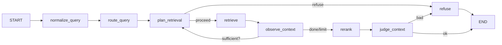

# RAG Knowledge Base

一套面向中文场景的**生产级 RAG 知识库问答系统**。后端基于 **FastAPI + LangGraph** 编排完整的 Agentic RAG 工作流,前端使用 **React 19 + Antd 6** 提供日常问答与运维界面,同时通过 **FastMCP** 把核心能力以工具形式开放给外部 Agent,可被 Claude / Cursor / 自研 Agent 等直接调用。

> 项目覆盖了一条真实可用的 RAG 链路:多格式文档入库 → 中文友好的混合检索 → Query 路由与多轮改写 → Rerank 精排 → 答案校验 → 拒答闸门 → 引用级可观测;并配套权限、限流、缓存、增量索引、自动化评测等工程能力。

---

## 核心特性

- **多格式文档解析与入库**:PDF / DOCX / Markdown / HTML 经 **Docling** 转 Markdown,自定义中文友好的 chunk 切分(默认 600 字 / 60 字重叠)。
- **中文混合检索**:`pgvector` HNSW 向量检索 + 自定义 PostgreSQL 镜像内置 **zhparser** 中文全文检索,使用 **RRF** 倒数排名融合,避免两路分数量纲不一致问题。
- **Agentic RAG 工作流**:基于 **LangGraph** 的 8 节点状态机 —— `normalize_query → route_query → plan_retrieval → retrieve → observe_context → rerank → judge_context → generate/refuse`,支持最多 3 轮的"再检索"循环,真正具备自我观察 / 重新规划能力。
- **Query 路由与改写**:`original / rewrite / hyde / multi_query` 四种策略按问题类型自动选择,`multi_query` 一次生成多个子查询以提高召回。
- **Rerank 精排 + 答案校验**:Qwen3-Rerank 二次精排;LLM 自我校验答案是否有引用支撑,无支撑时进入拒答。
- **语义缓存**:基于 **RedisVL + RediSearch** 的向量缓存,余弦相似度 ≥ 0.92 且权限范围一致才命中,显著降低二次问答成本。
- **滑动窗口限流**:Redis 实现的 per-user 限流(默认 60 req/min),保护 Embedding / LLM / 检索链路。
- **RBAC + 文档级权限**:`User / Role / permission_tags` 体系,文档可挂多个权限标签,检索 SQL 阶段就完成权限过滤,数据不外泄。
- **MCP Server**:同进程挂载 `/mcp` 端点(Streamable HTTP),提供 `ask_knowledge_base / upload_document / list_documents / get_document_status / get_knowledge_base_stats` 5 个工具,鉴权复用 JWT,适合 Claude / Cursor / 自研 Agent 直接接入。
- **自动化评测**:上传 jsonl 评测集即可后台跑 RAGAS 4 项指标 + 引用命中率 + 拒答准确率,自动归因 Bad Case 类目,前端可视化对比多次 Run。
- **增量重建**:`chunk_hash` 比对,只对新增 / 变更 chunk 重新 Embedding,大幅缩短重建耗时。
- **异步任务**:**Celery + Redis** 跑文档解析与向量化,前端轮询实时显示进度。
- **LangSmith 全链路可观测**:`@traceable` 覆盖 retrieve / rerank / 全链路,前端可直接跳转到 trace 查看中间产物。
- **SSE 流式问答**:服务端 `message_start → citations → token* → message_end` 事件协议,前端逐 token 渲染,引用 / Agent 步骤 / Trace URL 同步展示。

---

## 技术栈

| 层 | 选型 |
| --- | --- |
| 后端框架 | FastAPI 0.141 / Uvicorn |
| LLM 编排 | LangChain 1.3 / LangGraph 1.2 / LangSmith |
| ORM | SQLAlchemy 2.0(异步) + asyncpg + Alembic |
| 向量库 / 全文 | PostgreSQL 16 + pgvector(HNSW)+ zhparser(GIN tsvector) |
| 缓存 / 限流 / 队列 | Redis 7.4(redis-stack-server,内置 RediSearch)+ RedisVL |
| 异步任务 | Celery 5 + Redis Broker |
| 文档解析 | Docling 2.x(pdf / docx / md / html → markdown) |
| 切分 | LangChain RecursiveCharacterTextSplitter(中文分隔符) |
| Embedding | DashScope `text-embedding-v3`(1024 维) |
| Chat / 改写 / 校验 | DashScope `qwen-plus`(OpenAI 兼容协议) |
| Rerank | DashScope `qwen3-rerank` |
| 对象存储 | 腾讯云 COS(`cos-python-sdk-v5`) |
| 评测 | RAGAS 0.3(faithfulness / answer_relevancy / context_precision / context_recall)+ DeepEval |
| MCP | FastMCP 1.x(Streamable HTTP) |
| 前端 | React 19 / TypeScript 6 / Vite 8 / Antd 6 / React Query 5 / Zustand |
| 包管理 | uv(Python)+ npm(前端) |
| 部署 | Docker Compose(PostgreSQL + Redis) |

---

## 系统架构

```
┌──────────────────────────────────────────────────────────────────┐
│                         Frontend (React)                          │
│  ChatPage · DocumentsPage · EvaluationList · Users · Roles       │
│  SSE 流式渲染 · 引用面板 · Agent Steps · Trace URL · 语义缓存标记 │
└───────────────┬──────────────────────────────────────┬────────────┘
                │ REST + SSE                          │ OpenAPI 生成的 SDK
                ▼                                      │
┌──────────────────────────────────────────────────────────────────┐
│                       FastAPI Backend                             │
│  ┌──────────────────────────────────────────────────────────┐    │
│  │                  LangGraph RAG Workflow                   │    │
│  │  normalize_query → route_query → plan_retrieval          │    │
│  │   → retrieve → observe_context (loop) → rerank           │    │
│  │   → judge_context → generate / refuse                     │    │
│  └──────────────────────────────────────────────────────────┘    │
│  Ingestion Pipeline · Hybrid Retriever · Reranker · Verifier    │
│  Semantic Cache · Rate Limiter · Auth / RBAC · MCP Server        │
└─────────┬─────────────────┬─────────────────┬────────────────────┘
          │                 │                 │
          ▼                 ▼                 ▼
   ┌─────────────┐   ┌─────────────┐   ┌─────────────┐
   │ PostgreSQL  │   │   Redis     │   │ Tencent COS │
   │  + pgvector │   │  (Cache /   │   │  (files)    │
   │  + zhparser │   │  Limit /    │   └─────────────┘
   │             │   │  Celery)    │
   └─────────────┘   └─────────────┘
                          │
                          ▼
                  ┌─────────────┐
                  │   Celery    │
                  │  Worker(s)  │
                  └─────────────┘
```

外部 Agent 通过 `/mcp` 端点(Streamable HTTP + JSON 响应)复用 `ask_knowledge_base` / `upload_document` 等能力,鉴权复用同一套 JWT。

---

## 目录结构

```
.
├── backend/                       # FastAPI 后端
│   ├── app/
│   │   ├── main.py                # 应用入口、MCP 挂载点
│   │   ├── celery_app.py          # Celery 实例
│   │   ├── api/                   # 路由 / Schema / 依赖
│   │   │   ├── routes/            # auth / chat / documents / evaluations / users / roles
│   │   │   └── schemas/
│   │   ├── core/                  # config / logging / 限流 / 安全 / 异常 / 可观测
│   │   ├── db/                    # models / repositories / 迁移基线
│   │   ├── ingestion/             # 解析 / 切分 / embedding / 管道 / 异步任务
│   │   ├── retrieval/             # 向量 / 关键词 / 混合 RRF
│   │   ├── llm/                   # chat / embedder / reranker / verifier / planner
│   │   ├── workflows/             # LangGraph 图与节点
│   │   ├── mcp_server/            # FastMCP 工具注册与鉴权
│   │   ├── services/              # 业务编排(chat / document / evaluation / cache / permission …)
│   │   ├── evaluation/            # RAGAS runner / 评分
│   │   └── storage/               # COS 客户端 / 文件服务
│   ├── alembic/                   # 数据库迁移
│   └── err.log
├── frontend/                      # React 前端
│   ├── src/
│   │   ├── pages/                 # Chat / Documents / Evaluation / Users / Roles / Home
│   │   ├── components/            # CitationList / AgentStepsPanel / TraceIdPanel / …
│   │   ├── client/                # openapi-ts 自动生成的 SDK
│   │   ├── api/                   # 业务 API / SSE
│   │   ├── stores/                # zustand auth store
│   │   ├── routes/                # react-router 配置 + 路由守卫
│   │   └── layouts/
│   └── package.json
├── docker/                        # PostgreSQL 初始化脚本
├── docker-compose.yml             # postgres + redis-stack
├── postgres.Dockerfile            # 自定义 PG 镜像(pgvector + zhparser 多阶段构建)
├── .env.example                   # 环境变量模板
├── pyproject.toml                 # uv 项目定义
├── requirement.txt                # 锁定版本的依赖列表
├── run-backend.sh / .bat          # 本地启动脚本(带 UTF-8 修复)
└── README.md
```

---

## 快速开始

### 1. 环境要求

- Python **3.12 ~ 3.13**(`pyproject.toml` 限制)
- Node.js **20+**
- Docker / Docker Compose
- 一个 DashScope(阿里云百炼)API Key
- 一个腾讯云 COS Bucket 及对应 SecretId / SecretKey

### 2. 准备环境变量

```bash
cp .env.example .env
# 至少需要修改：
#   EMBEDDING_API_KEY / CHAT_API_KEY
#   COS_SECRET_ID / COS_SECRET_KEY / COS_BUCKET
#   JWT_SECRET（生产请用 openssl rand -hex 32 生成）
```

### 3. 启动基础设施(只跑 PG + Redis)

```bash
docker compose up -d --build
# 第一次会构建 pgvector + zhparser 镜像(多阶段编译,大约几分钟)
# 完成后监听:PostgreSQL :5432, Redis :6379
```

### 4. 启动后端

```bash
# macOS / Linux
./run-backend.sh

# Windows
run-backend.bat
# 等价于：cd backend && uv run uvicorn app.main:app --reload --host 0.0.0.0 --port 8000
```

首次启动会自动:
- 通过 Alembic 应用所有迁移(需手动 `alembic upgrade head`,或在你的启动脚本中加一行)
- 在库内无用户时种子创建默认管理员(由 `.env` 中 `DEFAULT_ADMIN_*` 控制)

可选:另起一个终端跑 Celery Worker(用于文档解析与向量化异步任务):

```bash
cd backend
uv run celery -A app.celery_app.celery_app worker --loglevel=INFO -Q ingest
```

### 5. 启动前端

```bash
cd frontend
npm install
npm run gen:api        # 从后端 OpenAPI 生成 TypeScript SDK,首次必需
npm run dev            # 默认 http://localhost:5173
```

### 6. 验证

打开 `http://localhost:5173`,使用 `.env` 中配置的默认账号登录,即可进入首页查看 Postgres / Redis / COS 健康状态,开始上传文档并提问。

---

## 环境变量

完整配置见 `.env.example`,关键项:

| Key | 作用 |
| --- | --- |
| `EMBEDDING_API_KEY` / `EMBEDDING_MODEL` / `EMBEDDING_DIM` | DashScope Embedding 配置(默认 `text-embedding-v3`, 1024 维) |
| `CHAT_API_KEY` / `CHAT_MODEL` | Chat 模型(默认 `qwen-plus`) |
| `RERANK_MODEL` / `RERANK_MIN_SCORE` | Rerank 精排(默认 `qwen3-rerank`,Top1 阈值 0.3) |
| `QUERY_ROUTE_ENABLED` / `MULTI_QUERY_COUNT` | Query 路由与多路召回开关 |
| `AGENT_LOOP_ENABLED` / `AGENT_MAX_ROUNDS` | Agentic RAG 循环开关与上限 |
| `SEMANTIC_CACHE_ENABLED` / `SEMANTIC_CACHE_MIN_SIMILARITY` | 语义缓存开关与相似度阈值(默认 0.92) |
| `RATE_LIMIT_PER_MINUTE` | 每用户每分钟写请求上限 |
| `JWT_SECRET` / `DEFAULT_ADMIN_*` | 鉴权与默认管理员种子 |
| `LANGSMITH_API_KEY` / `LANGSMITH_RUN_URL_PREFIX` | LangSmith 观测(可留空,关闭 trace) |
| `COS_SECRET_ID` / `COS_SECRET_KEY` / `COS_BUCKET` / `COS_REGION` | 腾讯云 COS 配置 |

所有开关项均设计为"开/关对比实验"友好 —— 关闭后该节点会直接旁路,便于在评测平台上做 A/B 对比。

---

## LangGraph 工作流

主链路节点(`backend/app/workflows/nodes/`):

1. **load_context** —— 加载会话最近 N 轮历史(默认 5 轮)
2. **normalize_query** —— 简单规范化
3. **route_query** —— LLM 决策本次走 `original / rewrite / hyde / multi_query`
4. **plan_retrieval** —— Agentic RAG 的"规划"节点,决定是 `proceed` / `rewrite_query` / `switch_route` / `refuse`
5. **retrieve** —— 走混合检索(HybridRetriever:向量 + 关键词 + RRF)
6. **observe_context** —— LLM 评估本轮候选是否足够;`False` 时回到 `plan_retrieval` 形成闭环
7. **rerank** —— Qwen3-Rerank 二次精排
8. **judge_context** —— 综合 Rerank Top1 分数与 `verify_answer` 结果决定 `END` 或 `refuse`
9. **generate / refuse** —— 生成回答或返回统一拒答文案



---

## API 概览

`backend/app/api/routes/` 下所有路由统一以 `/api` 为前缀,均自动生成 OpenAPI,可由前端 `npm run gen:api` 拉取类型。

| 路由 | 说明 |
| --- | --- |
| `POST /api/auth/login` | 用户名/密码登录,返回 JWT |
| `GET /api/auth/me` | 当前用户信息 |
| `POST /api/conversations` | 新建会话 |
| `GET /api/conversations/{id}` | 获取会话详情与历史消息 |
| `POST /api/conversations/{id}/chat` | **SSE** 流式问答(`message_start → citations → token* → message_end`) |
| `POST /api/documents` | 文档上传(仅管理员) |
| `GET /api/documents` | 文档列表(分页,按权限过滤) |
| `GET /api/documents/{id}` | 文档详情 + 最近一次入库任务 |
| `POST /api/documents/{id}/reindex` | 触发增量重建 |
| `GET /api/evaluations/datasets` | 列出可用评测集(jsonl) |
| `POST /api/evaluations/runs` | 新建一次评测(后台跑) |
| `GET /api/evaluations/runs/{id}` | 评测 Run 详情 + 指标 |
| `GET /api/users` / `POST /api/users` ... | 用户管理(仅管理员) |
| `GET /api/roles` / `POST /api/roles` ... | 角色与权限标签管理 |
| `GET /api/health/db` / `cos` / `app` | 健康检查 |

`/mcp` 端点(MCP Server)详情见下节。

---

## MCP 工具

服务以 `FastMCP(name="rag-knowledge-base", stateless_http=True, json_response=True)` 挂载在 `/mcp`,对外暴露以下 5 个工具,鉴权复用 `Authorization: Bearer <jwt>`:

| 工具 | 用途 | 权限 |
| --- | --- | --- |
| `ask_knowledge_base(question)` | 走完整 RAG 链路得到带引用的答案 | 登录用户(按权限过滤) |
| `upload_document(filename, content_base64, permission_tags?)` | 管理员上传文档;按 sha256 幂等 | 管理员 |
| `list_documents(page, page_size, status?)` | 列出当前用户可见的文档 | 登录用户 |
| `get_document_status(document_id)` | 查询文档状态 + 最近任务进度 | 登录用户(按权限过滤) |
| `get_knowledge_base_stats()` | 文档数 / chunk 数 / 最近入库时间 | 登录用户(按权限过滤) |

接入示例(伪代码):

```python
# 任何支持 MCP Streamable HTTP 的客户端都可以
client = MCPClient("http://localhost:8000/mcp", headers={"Authorization": f"Bearer {jwt}"})
answer = await client.call_tool("ask_knowledge_base", {"question": "员工差旅报销标准是什么?"})
# 返回 { answer, refused, citations: [...], trace_id }
```

---

## 评测

`backend/app/evaluation/` 提供了 RAGAS 评测流水线 + 自定义 Bad Case 归因:

- **数据集**:把 jsonl 评测集放到 `backend/datasets/`,每行一条 `case_id / question / expected_answer / expected_document_names / expected_keywords / should_refuse / tags`
- **Run 流程**:在前端 "评测" 页面选择数据集 → 后台异步跑完所有 case → 写入 `evaluation_runs` 与 `evaluation_items` 表
- **指标**:`faithfulness / answer_relevancy / context_precision / context_recall` + 引用命中率 + 拒答准确率 + 平均延迟 + 首 token 延迟
- **Bad Case 归因**:规则自动初判 `检索缺失 / 切分过细 / rerank 错排 / 校验过严 / 拒答过度 / 生成幻觉 / 其它`,前端可手动覆盖归类与备注,便于迭代分析

每次 run 都把每条 case 的输入快照写入库,数据集迭代不会污染历史对比基线。

---

## 鉴权与权限

- **JWT**:登录获取,默认 24h 过期,前端 `zustand` 持久化 + Axios 拦截器自动带上
- **角色管理**:`/api/roles` 维护角色与 `permission_tags`(特殊值 `*` 表示通配,等价 admin)
- **用户有效权限**:`compute_user_permission_tags(user)` 合并用户所有角色的 tag 集合
- **文档可见性**:`permission_tags` 为空数组视为公开;非空时与用户有效 tag 数组求重叠
- **检索 SQL**:`VectorRetriever` / `KeywordRetriever` 在 SQL 阶段就完成权限过滤,数据不会跨权限泄露
- **MCP 鉴权**:从请求头 `Authorization` 解析 JWT,`upload_document` 额外校验 admin

---

## 常见问题

**Q. Windows + 中文环境下启动报 `UnicodeDecodeError: 'gbk' codec ...`?**
A. 务必通过 `run-backend.bat` 启动后端,或自行设置 `PYTHONUTF8=1` 与 `PYTHONIOENCODING=utf-8`。`app/main.py` 顶部还会强制关闭 `torch._dynamo.config` 绕开 `torch.compile` 模板加载问题。

**Q. 改 Embedding 维度后报索引错误?**
A. 维度变更需要重建 `document_chunks.embedding` 列与 HNSW 索引;改 `EMBEDDING_DIM` 后请新增 Alembic 迁移,先 `DROP INDEX` 再改列类型。

**Q. PostgreSQL 容器首启动后看不到 zhparser 扩展?**
A. zhparser 的 `make install` 产物已由多阶段构建拷贝到运行镜像;`docker/postgres/init/01-extensions.sql` 在库内无数据卷时会自动 `CREATE EXTENSION`。已存在数据卷的库不会重跑,需要手动 `CREATE EXTENSION zhparser;` 后 `CREATE EXTENSION IF NOT EXISTS vector;`。

**Q. Celery 没起,上传文档会卡住?**
A. 上传是同步把文件写入 COS 并落库的(`uploading`),解析与向量化是 Celery 任务。任务未起,文档会停在 `uploading` 状态。起一个 worker:`cd backend && uv run celery -A app.celery_app.celery_app worker -Q ingest --loglevel=INFO`。

**Q. 想关闭某一段做对比实验?**
A. 几乎所有环节都有 `*_enabled` 开关:`QUERY_ROUTE_ENABLED` / `AGENT_LOOP_ENABLED` / `RERANK_ENABLED` / `VERIFY_ANSWER_ENABLED` / `SEMANTIC_CACHE_ENABLED` / `RATE_LIMIT_ENABLED`,配合评测平台即可做有 / 无对比。

---

## 路线图

- [ ] 多模态入库(图片 / 表格问答)
- [ ] Knowledge Graph 增强
- [ ] 用户级 Rate Limit 配额
- [ ] 在线学习反馈闭环(对回答 👍 / 👎 写回知识库)

---

## License

MIT
